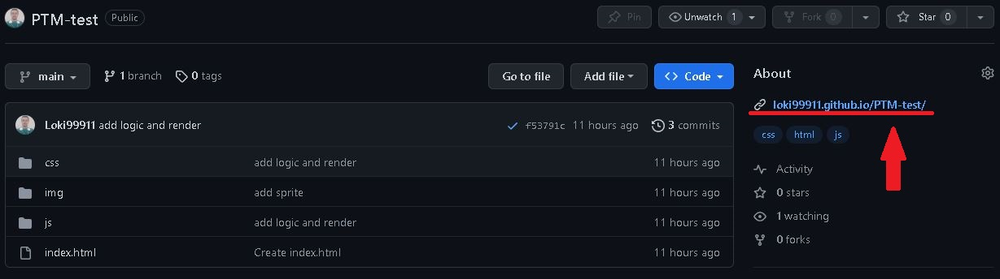
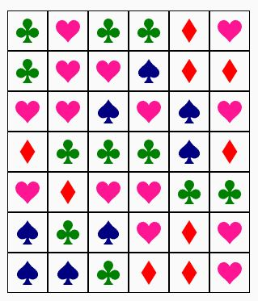

# Select the same

This is a repository for playing game "Select the same". Also for demonstrations the capabilities of Native JS and CSS.
***

## How to use

### Use on-line

To use the application online, you can use a direct link on GitHub:

 Or faster you can use this link: **[https://loki99911.github.io/PTM-test/](https://loki99911.github.io/PTM-test/)**

### Use localy

To use the application localy, follow next steps:

1. Clone the repository to your computer: `git clone` *https://github.com/Loki99911/PTM-test*
2. Use Life-server to run game.
3. It will open a new tab in the your browser: *http://localhost:0000*.
4. Injoy!

#### If you have done everything correctly, you will see the following pages:

***

## Technologies

The project is built with Native JS using Native CSS for styling.
***

## Developed by:
_Junior Frontend Developer - Nikita Kresik_:
**[GitHub](https://github.com/Loki99911)**,
**[Linkedin](https://www.linkedin.com/feed/)**
***